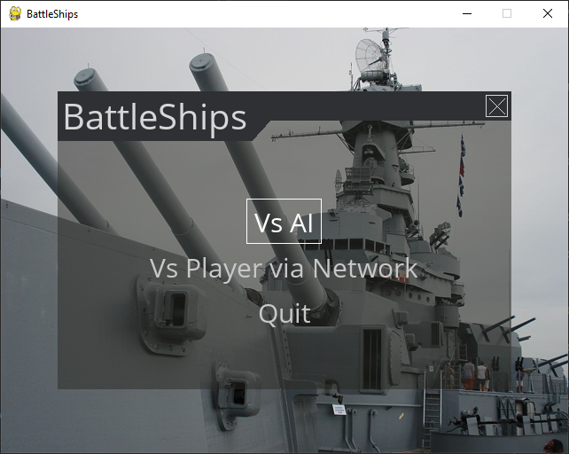
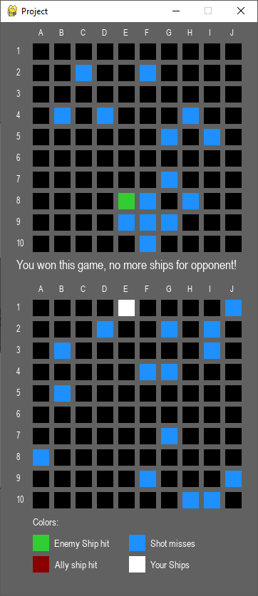

# BattleShips
> First python project

## Table of contents
* [General info](#general-info)
* [Screenshots](#screenshots)
* [Technologies](#technologies)
* [Setup](#setup)
* [Features](#features)
* [Status](#status)

## General info
Battleships is a game that can be played max in pair. The point of this game is to sink opponent's
ship faster than him/her. The application can be played vs ai, or another player via LAN. To be able to
do that server needs to be online.

## Screenshots

## Technologies
* pygame version 2.0.1
* pygame-menu version 3.3.2

## Setup
Needs to install libraries: pygame and pygame-menu, setup configuration of server (if multiplayer).
To be able to play on LAN - run server.py

## Code Examples
Show examples of usage:
`python main.py` - to run project

## Features
List of features ready and TODOs for future development
* Multiplayer
* Playing vs AI

To-do list:
* Lobby
* Points
* Re-do system of placing ships

## Status
Project is: _in progress_  because there can be more to add in the future
